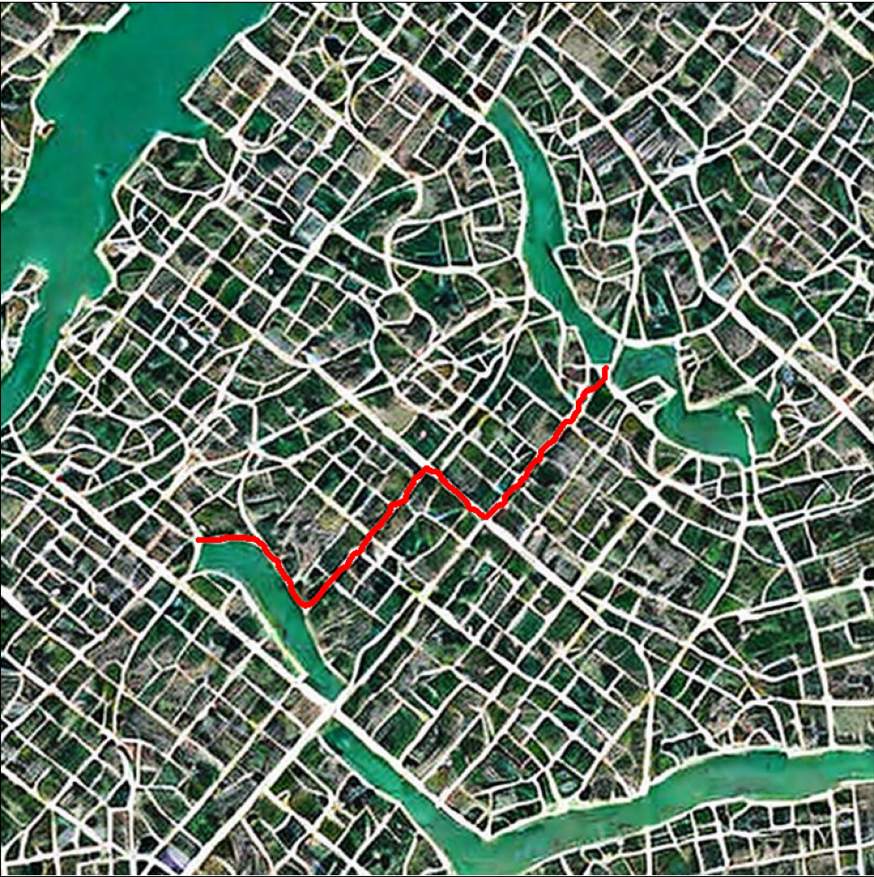

# Poszukiwanie najkrótszej ścieżki

<p align="center">


</p>

## Wstęp
Projekt miał na celu stworzenie programu który wczyta obraz mapy, gdzie drogi są jaśniejsze niż tło. Następnie pozwoli wybrać dwa punkty, a w końcu zwróci najkrótszą ścieżkę między nimi uwzględniając przy tym szerokości dróg po jakich będzie się poruszać.

## Generowanie map
Mapy zostały wygenerowane przez https://stablediffusionweb.com/#demo.

Do dema wielokrotnie została wpisana fraza: "birdseye city map with roads lighter than background".

## Opis działania
### Odczytanie punktu startowego i końcowego
Odczytanie puktów na mapie odbywa się poprzez prosty interfejs graficzny stworzony za pomocą biblioteki tkinter. Naniesione punkty nie muszą być idealnie na drodze, zostaną do niej przyciągnięte. Przyciągnie odbywa się w następujący sposób:
1) Sprawdzane jest czy punkt jest na drodze.
2) Jeśli nie: sprawdzane jest istnienie drogi w kwadracie o wymiarach 3x3.
3) Zwiększając rozmiar okna znajdowany jest najbliższy punkt według odległości Czebyszewa.
4) W przypadku wielu punktów o tej samej odłegłości wybierany jest pierwszy sprawdzony.
### Przygotowanie obrazu do wykonania algorytmu
Mapa jest kolejno:
1) Zamieniana na obraz w skali szarości.
2) Poddana binaryzacji.
3) Poddana procesowi thinningu.
   
Pierwsze dwa służą do oddzielenia dróg od tła. Ostatni punkt dokonuje erozji dróg, aż do otrzymania siatki dróg o grubości pojedynczego piksela.

Na podstawie tak przetworzonej mapy i mapy binarnej jest obliczana mapa szerokości. 
### Mapa szerokości
Algorytm poszukiwania najkrótszej ścieżki porusza się po tzw. mapie szerokości. Mapa ta obliczana jest w następujący sposób:
1) Na każdy piksel z siatki dróg uzyskanej w preprocesingu nakładany jest rdzeń w kształcie koła.
2) Do każdego piksela zapisywana jest maksymalna średnica r, która pozwoli na wmieszczenie się rdzenia w piksele ścieżki przed thinningiem.
3) Każda wartość r zostaje pomnożona przez stały współczynnik.
   
Mnożenie przez współczynnik zostało wykonane w celu wyraźnego pogłębienia efektu preferencji szerokich ścieżek.

W taki sposób dostajemy mapę, gdzie każdy piksel ścieżki ma tym większą wartość im szersza jest ścieżka którą reprezentuje. 

Dla celów algorytmu wartości te zostały odwrócone, aby najszersze ścieżki miały najmniejsze wartości. Zrobiono to poprzez wykonanie 2 operacji na całej mapie zgodnie ze wzorami:
    
    r = abs(r - max(r) - 1)
    
    r = r % max(r)
    
    ,gdzie r to wartość w punkcie, a max(r) to największa znaleziona wartość. Warto zaznaczyć, że max(r) w drugim wzorze będzie różna od max(r) w pierwszym ze względu na pierwszą operację.

### Poszukiwanie ścieżki
Algorytm poszukiwania ścieżki porusza się iteracyjnie po całej mapie szerokości, aż nie znajdzie punktu końcowego. 

Algorytm przechodzi piksel po pikselu. Jeżeli piksel na którym się aktualnie znajduje nie ma wartości zero to w danej iteracji odejmuje od niego 1. Jeżeli piksel ma wartość zero to przemieszcza się na piksele sąsiednie. Jeżeli pikseli sąsiednich jest więcej niż jeden to generuje dodatkowe instancje, które poruszają się niezależnie od siebie. Jeżeli wokół tego piksela nie ma żadnych niezerowych pikseli to dana instancja jest usuwana. Takie zachowanie pozwala na unikanie pętli.

Z takim mechanizmem instancja która pierwsza znajdzie punkt końcowy jest tą która znalazła najkrótszą ścieżkę. Każda instancja przechowuje ścieżkę po jakiej się poruszała, więc instancja zwycięska zwraca swoją po dotarciu do celu.

## Instrukcja obsługi
Na początek należy zainstalować potrzebne biblioteki. Można to zrobić za pomocą następującej komendy:
```
python -m pip install -r requirements.txt
```
Następnie procedura jest następująca:
1) Wykonujemy program podając mu ścieżkę do obrazu mapy (png lub gif) oraz opcjonalnie interwał po jakim ma pokazywać jaką część mapy już sprawdziliśmy. Przykładowa komenda wygląda następująco: `python main.py ./maps/map1.png --interval 5000`
2) Po wykonaniu komendy wyświetli nam się okno z mapą. W tym oknie należy wybrać dwa punkty pomiędzy którymi chcemy znaleźć najkrótszą ścieżkę.
3) Zgodnie z wybranym interwałem program wyświetli najpierw ile mapy jeszcze zostało do zwiedzenia a następnie ile mapy już zwiedziliśmy.
4) Na koniec jak już program znajdzie najkrótszą ścieżkę wyświetli ją na mapie.

## Podział ról
Cały projekt został wykonany przez Karola Kocierza oraz Wojciecha Korzybskiego. Prace nad projektem odbyły się w jednym pomieszczeniu wraz z ciągłą konsultacją dot każdego aspektu projektu. W związku z tym każdy ma udział w całości projektu. Najlepsze przybliżenie wykonanej pracy przedstawia się następująco:
1) Wygenerowanie map - Karol Kocierz
2) Zebranie koordynatów od użytkownika - Karol Kocierz
3) Przyciąganie koordynatów do dróg - Wojciech Korzybski
4) Binaryzacja - Wojciech Korzybski
5) Operacje morfologiczne - Wojciech Korzybski
6) Stworzenie mapy szerokości - Karol Kocierz
7) Stworzenie algorytmu szukającego ścieżkę - Karol Kocierz
8) Refaktoring - Karol Kocierz
9) Testy, wnioski - Obaj
10) Pomniejsze narzędzia i utilsy - Obaj
11) Dokumentacja - Obaj
