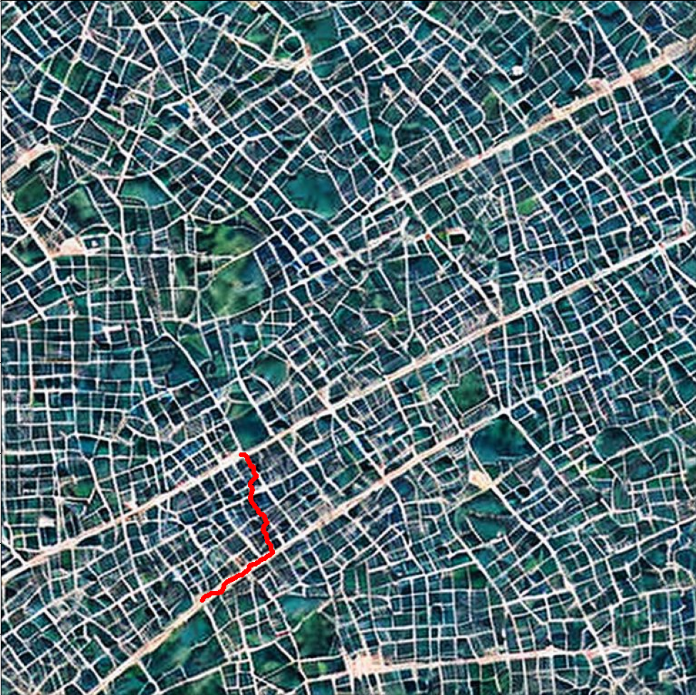

# Poszukiwanie najkrótszej ścieżki

<p align="center">


</p>

## Wstęp
Projekt miał na celu stworzenie programu który wczyta obraz mapy gdzie drogi są jaśniejsze niż tło, pozwoli wybrać dwa punkty a następnie zwróci najkrótszą ścieżkę między nimi uwzględniając przy tym szerokości dróg po jakich będzie się poruszać.

## Opis działania
### Odczytanie punktu startowego i końcowego
Odczytanie puktów na mapie odbywa się poprzez prosty interfejs graficzny stworzony za pomocą biblioteki tkinter. Naniesione punkty nie muszą być idealnie na drodze, zostaną do niej przyciągnięte OPISZ ALGORYTM PRZYCIĄGANIA.
### Przygotowanie obrazu do wykonania algorytmu
Mapa jest kolejno:
1) Zamieniana na obraz w skali szarości.
2) Poddana binaryzacji.
3) Poddana procesowi thinningu OPISZ THINNING JEŻELI BYŁO COŚ WIĘCEJ.

Na podstawie tak przetworzonej mapy i mapy binarnej jest obliczana mapa szerokości. 
### Mapa szerokości
Algorytm poszukiwania najkrótszej ścieżki porusza się po tzw. mapie szerokości. Mapa ta obliczana jest w taki sposób że tworzone są mapy tymczasowe gdzie każda reprezentuje piksele z mapy po thinningu które jak nałożyć na nie rdzeń w kształcie koła o średnicy r to to jądro zmieści się wewnątrz ścieżki na mapie binarnej. Następnie te mapy są kolejno sumowane z pomnożeniem przez r z jakim były tworzone. Mnożenie przez r zostało dodane dla pogłębienia efektu preferencji szerokich ścieżek.

W taki sposób dostajemy mapę gdzie każdy piksel ścieżki ma tym większą wartość im szersza jest ścieżka którą reprezentuję.

### Poszukiwanie ścieżki
Algorytm poszukiwania ścieżki porusza się iteracyjnie po całej mapie szerokości aż nie znajdzie punktu końcowego. 

Algorytm przechodzi piksel po pikselu. Jeżeli piksel na którym się aktualnie znajduje nie ma wartości zero to w danej iteracji odejmuje od niego 1. Jeżeli piksel ma wartość zero to przemieszcza się na piksele sąsiednie. Jeżeli pikseli sąsiednich jest więcej niż jeden to generuje dodatkowe instancje które poruszają się niezależnie od siebie. Jeżeli wokół tego piksela nie ma żadnych niezerowych pikseli to dana instancja jest usuwana.

Z takim mechanizmem instancja która pierwsza znajdzie punkt końcowy jest tą która znalazła najkrótszą ścieżkę. Każda instancja przechowuje ścieżkę po jakiej się poruszała więc instancja zwycięzka zwraca swoją po dotarciu do celu.

## Instrukcja obsługi
Na początek należy zainstalować potrzebne biblioteki. Można to zrobić za pomocą następującej komendy:
```
python -m pip install -r requirements.txt
```
Następnie procedura jest następująca:
1) Wykonujemy program podając mu ścieżkę do obrazu mapy (png lub gif) oraz opcjonalnie interwał po jakim ma pokazywać jaką część mapy już sprawdziliśmy. Przykładowa komenda wygląda następująco: `python main.py ./maps/map1.png --interval 5000`
2) Po wykonaniu komendy wyświetli nam się okno z mapą. W tym oknie należy wybrać dwa punkty pomiędzy którymi chcemy znaleźć najkrótszą ścieżkę.
3) Zgodnie z wybranym interwałem program wyświetli najpierw ile mapy jeszcze zostało do zwiedzenia a następnie ile mapy już zwiedziliśmy.
4) Na koniec jak już program znajdzie najkrótszą ścieżkę wyświetli ją na mapie.
